# Research Companion

<p align="center">
  <strong>A local research assistant with memory that can change without losing the evidence behind it.</strong>
</p>

<p align="center">
  <a href="#quick-start">Quick start</a> ·
  <a href="#the-memory-model">Memory model</a> ·
  <a href="#architecture">Architecture</a> ·
  <a href="#limitations-and-scope">Limitations</a>
</p>

<p align="center">
  
  
  
  
</p>

Research Companion is a small, local-first demonstration of an agent that remembers findings, constraints, and decisions across fresh conversations. It combines a streamed Deep Agents interface with a custom memory engine inspired by A-MEM and Mem0.

The interesting part is not just recall. When a user changes direction, the application reconciles the new statement, preserves the previous version, evolves useful metadata, records evidence-backed links, and makes the result inspectable in the UI.


## Why this project exists

Most chat demos treat memory as a growing transcript. This project treats it as a small evidence graph:

- user constraints, decisions, assistant proposals, and paper findings stay distinguishable;
- a changed fact can supersede an earlier version without deleting its source;
- notes gain context, tags, embeddings, and links through bounded post-response work;
- current retrieval excludes obsolete versions by default, while historical retrieval remains available;
- the Memory panel shows what was recalled, what changed, and how notes connect.

The bundled scenario is intentionally compact:

1. Compare A-MEM and Mem0 with a focus on retrieval quality.
2. Change the constraint to one week and focus on changing facts.
3. Start a fresh conversation and ask for the smallest experiment.
4. Inspect the evidence, version history, operations, connections, and cited report.

## What you can explore

| Area           | Included                                                                                                                     |
| -------------- | ---------------------------------------------------------------------------------------------------------------------------- |
| Agent workflow | Planning with todos, local paper search/read tools, targeted memory recall, and report generation under`/reports/`         |
| Memory writes  | Structured extraction,`ADD`, `UPDATE`, `SUPERSEDE`, `NOOP`, `ENRICH`, `EVOLVE`, and `LINK` operations          |
| Memory reads   | Embedding retrieval, one-hop link expansion, deterministic reranking, current/history filtering, and bounded context packing |
| Inspection     | Recalled evidence, source excerpts, version history, operation reasons, metadata history, and immediate connections          |
| Local corpus   | Selected, attributed extracts from A-MEM, Mem0, and LongMemEval                                                              |
| Runtime        | Next.js frontend, local LangGraph server, Python DeepAgent, and SQLite persistence                                           |

## Quick start

### Prerequisites

- Python 3.11–3.13; Python 3.13 is recommended
- [`uv`](https://docs.astral.sh/uv/)
- Node.js 22+ and npm
- A model provider key for live mode, or no key at all for the scripted demo

### 1. Install the backend

```sh
cd backend
uv sync --frozen
```

The repository includes prepared paper extracts in a working checkout. To regenerate them from the pinned sources, run:

```sh
uv run python scripts/prepare_papers.py
```

That preparation step needs network access once. Paper search and reading are local at runtime.

### 2. Choose a model mode

For the fastest first run, use the deterministic, credential-free demo:

```sh
cp .env.example .env
```

Then set `RESEARCH_MODEL=demo` in `backend/.env`.

For live mode, keep the default model and set `GOOGLE_API_KEY` in `backend/.env`:

```dotenv
RESEARCH_MODEL=google_genai:gemini-3.5-flash
GOOGLE_API_KEY=your-google-api-key
RESEARCH_EMBEDDING_MODEL=google_genai:gemini-embedding-001
```

Chat and embeddings are configured independently. An OpenAI-compatible chat or embedding endpoint can be configured through the variables in [`backend/.env.example`](backend/.env.example).

### 3. Start the backend

From `backend/`:

```sh
uv run langgraph dev --no-browser --host 127.0.0.1 --port 2024
```

### 4. Start the frontend

In a second terminal:

```sh
cd frontend
npm ci
npm run dev
```

Open [http://localhost:3000](http://localhost:3000). The frontend defaults to the LangGraph server at `http://127.0.0.1:2024` and the `research` assistant. The Settings dialog can override those values.

## Try the scripted demo

The end-to-end demo uses a temporary SQLite database and an in-memory checkpointer, so it never resets or modifies your normal runtime store:

```sh
cd backend
uv run python -m app.demo
```

Expected output ends with:

```text
PASS: fresh-thread report, changed objective, evidence, evolution, and connections.
Scripted lexical demo only; browser and live-provider quality are not verified.
```

To reproduce the same flow in the UI, start the backend with `RESEARCH_MODEL=demo`, then send these prompts in separate conversations:

1. `Compare A-MEM and Mem0. I’m interested in retrieval quality.`
2. `I only have a week. Let’s focus on handling changing facts.`
3. `Design the smallest experiment for my project, and explain our choices.`

Use the Memory panel to inspect the recalled source excerpts, the `SUPERSEDE` and `EVOLVE` operations, and the links that contribute to the final experiment proposal.

## The memory model

Memory is project-scoped and survives fresh chat threads. Each interaction is recorded as immutable source evidence before consolidation. Accepted facts receive versioned notes, provenance, metadata, embeddings, and links.

```text
messages + paper/tool evidence
            │
            ▼
       extract candidates
            │
            ▼
       reconcile against neighbors
       ADD · UPDATE · SUPERSEDE · NOOP
            │
            ▼
       enrich accepted notes
       context · tags · keywords · embeddings
            │
            ▼
       add evidence-backed links
       related_to · explains · supersedes
            │
            ▼
       commit versions, operations, and summary atomically
```

The read path retrieves up to ten direct candidates, expands one hop through links, reranks the combined set, and packs the result into the configured memory budget. The current implementation bounds that context by serialized UTF-8 bytes: the default budget is 2,000 bytes, while the scripted walkthrough uses 10,000 bytes so its enriched notes fit together.

## Architecture



The UI and DeepAgent remain on the root LangGraph so streamed messages, todos, and thread-local report files continue to work. `MemoryWorkflow` supplies recalled context before the agent runs and consolidates the completed exchange afterward. Browser callbacks are read-only; memory writes happen server-side.

### Main components

- `frontend/` — adapted React/Next.js Deep Agents UI with thread history, chat streaming, todos, files, tool calls, and the Memory panel.
- `backend/app/agent.py` — DeepAgent definition and paper/memory tools.
- `backend/app/workflow.py` — recall → agent → ingestion lifecycle middleware.
- `backend/app/memory/` — extraction, reconciliation, enrichment, embeddings, storage, retrieval, inspection, and retry logic.
- `backend/app/papers.py` — safe search and reading over the prepared local corpus.
- `data/papers/` — manifest and generated local extracts; the generated JSON files are ignored by Git.

## Useful commands

Run backend tests and checks from `backend/`:

```sh
uv run pytest
uv run ruff check .
```

Run frontend checks from `frontend/`:

```sh
npm run typecheck
npm run lint
npm run build -- --webpack
```

If a memory consolidation fails after a response, the answer and report remain available. Pending interactions can be inspected and retried from `backend/`:

```sh
uv run python -m app.memory.retry
```

The default database is `data/runtime/memory.sqlite3`. It is ignored by Git and persists across backend restarts.

## Repository layout

```text
.
├── backend/
│   ├── app/
│   │   ├── memory/       # memory engine and inspection APIs
│   │   ├── agent.py      # DeepAgent and tools
│   │   ├── workflow.py   # recall → run → ingest
│   │   └── papers.py     # local corpus access
│   └── tests/             # credential-free correctness tests
├── data/papers/           # manifest and prepared paper extracts
├── docs/images/           # README visuals
├── frontend/              # Next.js interface
├── PLAN.md                # original project plan and milestone history
└── README.md
```

## Limitations and scope

This is a focused local demo, not a production deployment or a reproduction of the papers' published results.

- single user, one configured research project, local SQLite;
- no authentication, cloud deployment, background queues, or multi-user isolation;
- no arbitrary PDF ingestion, OCR, live web search, or external account integrations;
- the scripted mode uses bounded pattern recognition and lexical retrieval, not general model reasoning;
- live model and embedding quality depends on the configured provider and has not been benchmarked here;
- the current context packer uses a conservative serialized UTF-8 byte bound rather than a tokenizer-aware token count;
- browser smoke testing was skipped; automated backend and frontend validation is documented in the project history.

The paper corpus contains selected text extracts, not complete papers. See [`data/papers/README.md`](data/papers/README.md) for attribution and source links.
